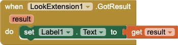
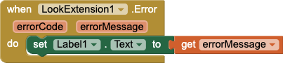

# Tutorial: Create a MobileNet Extension

## Prerequisites

* Java 8
* Ant 1.10
* Python 3
* Node and npm
* git

## Install App Inventor TFJS generator

```
pip install appinventor-tfjs
```

## Create the LookExtension Template

```
python -m appinventor.tfjs mobilenet com.example.mobilenet.LookExtension
```

This will create a new directory called LookExtension in your current directory. It will create a template LookExtension.java file for your App Inventor extension as well as retrieve all of the mobel data needed for MobileNet.

## Edit app.js

In the `loadModel` function, locate the `mobilenet.load(...)` call and replace it with the following data:

```
return mobilenet.load({version: 2, alpha: 0.5});
```

In the `classifyFrame` function, locate the the `net.evaluate` call to:

```
const result = await net.classify(video, 5);
```


## Compile the Extension

In a shell, run the `ant` command from within the LookExtension directory. This will produce an App Inventor extension com.example.mobilenet.aix in a directory called `out`.

## Build an App

### Load LookExtension

Open [App Inventor](http://ai2.appinventor.mit.edu) and start a new project. Load your .aix file produced in the last step.

### Designer

1. Add a Label to the Screen
2. Add a WebViewer to the Screen
3. Add a LookExtension to the Screen
4. Set the WebViewer property of LookExtension1 to WebViewer1

### Blocks

Add the following blocks to your project:






### Connect the Companion

On your mobile device, start the MIT AI2 Companion. In App Inventor, click Connect then AI Companion. Scan the QR code with the companion app.

## Appendix A: Annotations

### DesignerComponent

The `@DesignerComponent` annotation controls how a component appears in the App Inventor user interface designer. For extensions, the key fields you will need to set are:

- `category` [default: UNINITIALIZED]: Should always be set to `ComponentCategory.EXTENSION`.
- `nonVisible` [default: false]: Should always be `true`. App Inventor doesn't yet support visible extensions.
- `version`: Set to a non-negative number to indicate the version of the component. Generally, increase the version number when you add new functionality to your extension.

### SimpleObject

The `@SimpleObject` annotation is used to identify objects that App Inventor's build system should process during compilation. You must include this annotation, and for extensions you must set the field `external` to `true`, for example:

```java
@SimpleObject(external=true)
public class MyExtension extends AndroidNonvisibleComponent {
  // ...
}
```

### DesignerProperty

The `@DesignerProperty` annotation provides App Inventor information about properties that should appear in the "Properties" section of the user interface designer. It has a number of fields, but the two that are relevant to extensions are:

- `editorType` [default: PROPERTY\_TYPE_TEXT] Specifies what type of editor should be shown to "set" this property.
- `defaultValue` [default: ""]: The default value of the property.

### SimpleProperty

The `@SimpleProperty` annotation tells the App Inventor preprocessor that the annotated method should be shown in App Inventor as a property block. The signature must either be a 0-arity function that returns a value (getter) or a 1-arity function that returns void (setter). The `@SimpleProperty` annotation has the following fields:

- `category`: [default: UNSET]: Unused, but can be specified as either APPEARANCE or BEHAVIOR.
- `description` [default: ""]: A description of the property that will appear in the block tooltip.
- `userVisible` [default: true]: Shows or hides the block in the blocks editor.

### SimpleFunction

The `@SimpleFunction` annotation tells the App Inventor preprocessor that the annotated method should be shown in App Inventor as a method block. For asynchronous methods, you will need to have a corresponding `@SimpleEvent` so the user can handle the completion of the method.

### SimpleEvent

The `@SimpleEvent` annotation tells the App Inventor preprocessor that the annotated method should be shown in App Inventor as an event block. Typically, a method annotated as an event only calls `EventDispatcher.dispatchEvent()`.
